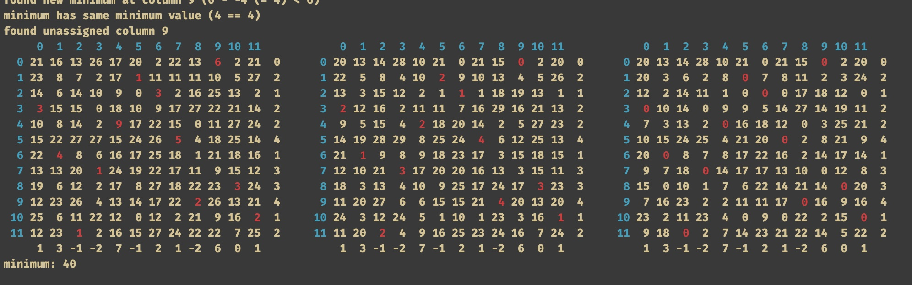

# jvc-assignment-problem
c implementation of the jvc algorithm

The JVC (Jonker, Volgenant and Castanon) algorithm is one of the most fastest algorithms to solve the [assignment problem](https://en.wikipedia.org/wiki/Assignment_problem).

The code consists of an [existing implementation](https://github.com/AlexanderSobolev1990/lap/blob/master/src/lap/src/lap_jvc_dense.cpp#L54) on github but with some small amendments:

* the cost matrix is in integers (instead of doubles)
* added the brute force method to compare the optimal solution
* added debug printf's to clarify what is going on in the algorithm
* added a print_m() function that prints out the original matrix with coloring together with the reduced matrix (column wise) and another reduced matrix (column and row wise)
* keep track of the row reduction (not needed in the original implementation), added for clarification

To see the colors in the console window of Xcode as shown above you'll need to install a special font called `ColoredConsole-Bold.ttf`. You can download this font and find instruction on how to install it in Xcode on this [github repo](https://github.com/jjrscott/ColoredConsole))

This is an example of the (Xcode) console output of a 12x12 cost matrixs:

